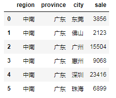

### API 列表

`pyg2` 目前支持的图表 api 列表及对应参数:

| api | args |
| --- | --- |
| line | `data, xField, yField, seriesField='', cfg={}` |
| treemap | `data, maxLevel, cfg={}` |
| step_line | `data, xField, yField, seriesField='', step='', cfg={}` |
| bar | `data, xField, yField, colorField='', cfg={}` |
| stacked_bar | `data, xField, yField, stackField='', cfg={}` |
| grouped_bar | `data, xField, yField, groupField='',cfg={}` |
| percent_stacked_bar | `data, xField, yField, stackField, cfg={}` |
| range_bar | `data, xField, yField, colorField='', cfg={}` |
| area | `data, xField, yField, seriesField='', cfg={}` |
| stacked_area | `data, xField, yField, stackField ='',cfg={}` |
| percent_stacked_area | `data, xField, yField, stackField='', cfg={}` |
| column | `data, xField, yField, colorField='', cfg={}` |
| grouped_column | `data, xField, yField, groupField='', cfg={}` |
| stacked_column | `data, xField, yField, stackField='', cfg={}` |
| range_column | `data, xField, yField, colorField='', cfg={}` |
| percent_stacked_column | `data, xField, yField, stackField='', cfg={}` |
| pie | `data, colorField, angleField, radius=0.8, cfg={}` |
| density_heatmap | `data, xField, yField, colorField, cfg={}` |
| heatmap | `data, xField, yField, colorField, sizeField='', shapeType='rect', cfg={}` |
| rose | `data, radiusField, categoryField, colorField='', cfg={}` |
| funnel | `data, xField, yField,compareField='',dynamicHeight=False,transpose=False,cfg={}` |
| stacked_rose | `data, radiusField, categoryField, stackField, cfg={}` |
| grouped_rose | `data, radiusField, categoryField, colorField, cfg={}` |
| radar | `data, angleField, radiusField, seriesField='', cfg={}` |
| histogram | `data, binField, binWidth=None, binNumber=None, cfg={}` |
| density | `data, binField, binWidth=None, binNumber=None, cfg={}` |
| donut | `data, angleField, colorField='', cfg={}` |
| waterfall | `data, xField, yField, colorField='', cfg={}` |
| scatter | `data, xField, yField, colorField='', cfg={}` |
| bubble | `data, xField, yField, colorField, sizeField, cfg={}` |
| bullet | `data, rangeMax, measureSize=20, cfg={}` |
| calendar | `data, dateField, valueField, months='', weeks='', cfg={}` |
| word_cloud | `data, maskImage='', shape='circle', cfg={}` |
| gauge | `value, range=[], min=0, max=1, cfg={}` |
| fan_gauge | `value, range=[], min=0, max=1, cfg={}` |
| meter_gauge | `value, range=[], min=0, max=1, cfg={}` |
| liquid | `value, max, min, cfg={}` |

**例子**
```python
line(data, xField, yField, seriesField='', cfg={}).render()
```

`pyg2` 几乎所有的图表 API 都有上面折线图类似的参数, 大致可分为三个部分:

#### :whale2: data

`data` 参数设置图表的数据源, 其格类型为 `pandas.core.frame.DataFrame`, 对于 data 参数, 需注意一下几点：

- 字段名: 仅使用英文及数字, 不推荐使用中文作为字段名, 不能包含 `点(.)`
- 作图前先使用 `reset_index` 将复合索引重置
- 仅传入作图所需的数据, 其他作图无需用到的列建议先剔除, 尤其在数据量大的情况下.

!> treemap 的数据要求

treemap的数据要求前N列为**分组列**, 最后一列为**数据列**.

?> 以区域销售数据为例, `treemap` 的数据要求：前 **3** 为**分组列**, 最后一列销售额为**数据列**. 分组列的层级顺序不作要求, 会自动根据数据集进行调整.



#### :whale2: *Field

`*Field` 是视觉映射参数, 用于设置图表组件与数据列的映射关系.

- `xField` 将列映射到 x 轴
- `yField` 将列映射到 y 轴 
- `colorField` 将列映射为颜色区分
- `seriesField` 用于数据分组, 分类字段
- `sizeField` 热力图/气泡图中指定色块形状大小(气泡大小)的字段, **连续字段**
- `groupField` 条形图中数据集的分组字段名, 通过颜色区分
- `angleField` 饼图/环形图扇形切片大小(弧度)所对应的数据字段名, **连续字段**
- `stackField` 用于数据分组, 分类字段. 一般用于堆叠图, stacked_area, stacked_bar, percent_stacked_bar 等
- `radiusField` 玫瑰图扇形切片半径长度所对应的数据字段名
- `categoryField` 玫瑰图扇形切片分类所对应的数据字段名(每个扇形的弧度相等)
- `dateField` 日历图中对应日期数据的字段
- `valueField` 日历图中对应每个格子中值的字段
- `compareField` 对比漏斗图数据的对比字段名, 分类字段

#### :whale2: cfg

?> 大部分场景下, 你无需进行自定义配置, 使用默认配置即可生成美观的图表.

通过图表 API 的 cfg 参数(类型为 `dict`), 可以为图表配置任何符合 G2Plot 标准的配置.

常用的**通用配置**及默认值：

| 配置项 | 类型 | 描述 | 默认值 |
| --- | --- | --- | --- |
| width | **可选**, *number* | 设置图表宽度 | `400` |
| height | **可选**, *number* | 设置图表高度 | `400` |
| forceFit | **可选**, *boolean* | 图表是否自适应容器宽高. 当 `forceFit` 为True时, `width` 和 `height` 设置将失效 | `True` |
| pixelRatio | **可选**, *number* | 设置图表渲染的像素比 | `2` |
| renderer | **可选**, *string* | 设置图表渲染方式为 `canvas` 或 `svg` | `canvas` |
| theme | **可选**, *string* | 设置图表主题为 `default` 或 `dark` | `default` |


?> `pyg2` 图表配置使用 `dict` 数据格式

```python
cfg = {
  'width': 400,
  'height': 400,
  'forceFit': True,
  'pixelRatio': 2,
  'renderer': 'canvas',
  'theme': 'default'
}
bar(df, 'x', 'y', cfg=cfg).reander()
```

#### :whale2: 不常见参数解释

| api | 参数说明 | 默认值 |
| --- | --- | --- |
| treemap | `maxLevel` 最大嵌套层级 | 无 |
| step_line | `step` 阶梯转折形态, 可选配置为: `hv` | `vh` | `vhv` | `hvh` | `hv` |
| pie | `radius` 半径, 原点为画布中心. 值范围 [0,1], 0 代表饼图不显示, 1 代表饼图撑满绘图区域. |`0.8`, 即 `width / 2 * 0.8` |
| heatmap | `shapeType` 指定色块形状的类型, 可选值: `rect`, `circle` 两种. | `rect` |
