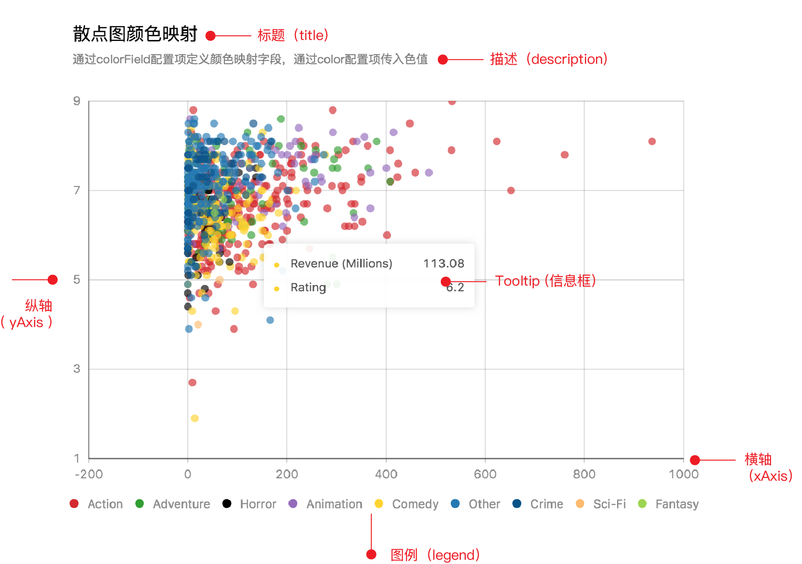

# 图表组件


`pyg2` 图表组件 API 用于配置图表的各个组件部分, 如`标题` `坐标轴` `图例` `辅助线` 等, 完整 API 列表如下:

| API | args |
| --- | --- |
|title | `title='', description='', title_cfg={}, description_cfg={}` |
|guide_line | `cfg={}` |
|legend | `cfg={}` |
|axis | `xAxis={}, yAxis={}` |
|tooltip | `cfg={}` |
|theme | `theme` |
 
#### 如何调用

```python
bar(df, 'x', 'y').title(title='标题').render()
bar(df, 'x', 'y').legend(cfg={}).render()
bar(df, 'x', 'y').theme('dark').render()
```


 
#### :whale2: 标题与描述 title-description

?> 标题及描述统一通过 `title()` 进行设置

- 如果仅仅需要增加图表标题或描述, 直接将标题或描述传递给参数 `title` 或 `description` 即可.
```python
bar(df, 'x', 'y').title(title='标题').render()
bar(df, 'x', 'y').title(subtitle='这是一段长的图表描述文字').render()
bar(df, 'x', 'y').title(title='标题', subtitle='这是一段长的图表描述文字').render()
```

- 如果需要对标题或描述的文字进行样式调整, 则需要使用配置参数 `title_cfg` 或 `description_cfg`.
```python
title_cfg = {
  'visible': False,
  'alignTo': 'left',
  'text': '',
  'style': {
      'fontSize': 18,
      'fill': 'black',
  }
}
bar(df, 'x', 'y').title(title_cfg=title_cfg).render()
description_cfg = {
  'visible': False,
  'alignTo': 'left',
  'text':'',
  'style':{
      'fontSize': 12,
      'fill': 'grey',
  }
}
bar(df, 'x', 'y').title(description_cfg=description_cfg).render()
```

**标题及描述详细配置:**

| 细分配置 | 类型    | 功能描述 |
| --- | --- | --- |
| visible  | boolean | 是否显示 |
| alignTo  | string  | 位置，支持三种配置：<ul><li>left</li><li>middle</li><li>right</li></ul> |
| style    | dict  | 样式：<br />- fontSize: number 文字大小<br />- fill: string 文字颜色<br />- stroke: string  描边颜色<br />- lineWidth: number 描边粗细<br />- lineDash: number 虚线描边<br />- opacity: number 透明度<br />- fillOpacity: number 填充透明度<br />- strokeOpacity: number 描边透明度<br /> |

#### :whale2: 主题 theme

可以通过两种方式设置主题:

- 作图函数的 `cfg` 参数:
```python
cfg = {'theme':'dark'}
point(df,'x','y',cfg=cfg).render()
```
- `theme` 方法:
```python
point(df,'x','y').theme('dark').render()
````


#### :whale2: 坐标轴 axis

`pyg2` 坐标轴设置分 `catergoryAxis` 与 `linearAxis` 两种情况

##### catergoryAxis

`catergoryAxis` 用于展示分类数据映射信息的坐标轴, 柱状图 `xAxis` 及条形图 `yAxis` 都属于分类轴

默认配置：

```python
cfg = {
  'visible': True,
  'grid': {
      'visible': False,
  },
  'line': {
      'visible': True
  },
  'tickLine': {
       'visible': True,
  },
  'label': {
      'visible': True,
      'autoRotate': True,
      'autoHide': True
  },
  'title': {
      'visible': False,
      'offset': 12,
  }
}
# 设置 xAxis
bar(df, 'x', 'y').axis(xAxis=cfg).render()
# 设置 yAxis
bar(df, 'x', 'y').axis(yAxis=cfg).render()
```

| 细分配置 | 类型    | 功能描述 |
| --- | --- | --- |
| visible  | boolean | 是否可见 |
| line     | dict  | 坐标轴轴线<br />- visible: boolean 是否可见<br />- style：dict 轴线样式<br /> |
| grid     | dict  | 网格线<br />- visible: boolean 是否可见<br />- style：dict 网格线样式<br /> |
| label    | dict  | 坐标轴标签<br />- visible: boolean 是否可见<br />- formatter: function  坐标轴标签格式化<br />- suffix: string 后缀<br />- offsetX: number 位置在 x 方向上的偏移量<br />- offsetY：number 位置在 y 方向上的偏移量<br />- style：dict 样<br /> -autoHide: boolean 是否自动隐藏<br/>-autoRotate: boolean 是否自动旋转 |
| tickLine | dict  | 坐标轴刻度<br />- visible：boolean 是否可见<br />- style: dict 样式<br /> |
| title    | dict  | 坐标轴标题<br />- visible： boolean 是否可见<br />- text: string 标题文字<br />- offset: number 位置偏移量<br />- style：dict 样式<br /> |

### linearAxis

用于展示连续性映射数据的坐标轴，如柱状图、折线图的 yAxis

默认配置：

```python
cfg = {
  'visible': True,
  'grid': {
      'visible': False,
  },
  'line': {
      'visible': True
  },
  'tickLine': {
       'visible': True,
  },
  'label': {
      'visible': True,
      'autoRotate': True,
      'autoHide': True
  },
  'title': {
      'visible': False,
      'offset': 12,
  }
}
# 设置 xAxis
bar(df, 'x', 'y').axis(xAxis=cfg).render()
# 设置 yAxis
bar(df, 'x', 'y').axis(yAxis=cfg).render()
```

| 细分配置     | 类型    | 功能描述 |
| --- | --- | --- |
| visible      | boolean | 是否可见 |
| tickCount    | number  | 坐标轴刻度数量 |
| tickInterval | number  | 坐标轴刻度间隔 |
| min          | number  | 设置坐标轴最小值 |
| max          | number  | 设置坐标轴最大值 |
| line         | dict  | 坐标轴轴线<br />- visible: boolean 是否可见<br />- style：dict 轴线样式<br /> |
| grid         | dict  | 网格线<br />- visible: boolean 是否可见<br />- style：dict 网格线样式<br /> |
| label        | dict  | 坐标轴标签<br />- visible: boolean 是否可见<br />- formatter: function 坐标轴标签格式化 DEMO<br />- suffix: string 后缀<br />- precision：number  标签精度，如配置为 2，则格式化为 2 位小数<br />- offsetX: number 位置在 x 方向上的偏移量<br />- offsetY：number 位置在 y 方向上的偏移量<br />- style：dict 样<br /> -autoHide: boolean 是否自动隐藏<br/>-autoRotate: boolean 是否自动旋转 |
| tickLine     | dict  | 坐标轴刻度<br />- visible：boolean 是否可见<br />- style: dict 样式<br /> |
| title        | dict  | 坐标轴标题<br />- visible： boolean 是否可见<br />- text: string 标题文字<br />- offset: number 位置偏移量<br />- style：dict 样式<br /> |


#### :whale2: 图例 legend

图例在配置 `colorField` 时显示, 用于展示颜色分类信息.

默认配置为:
```python
cfg = {
  'visible': True,
  'position': 'top',
  'flipPage': True
}
point(df, 'x', 'y').legend(cfg=cfg).render()
```

**图例详细配置:**

| 配置项 | 类型 | 功能描述 |
| --- | --- | --- |
| visible | boolean | 是否可见 |
| position  | string   | 位置，支持 12 方位布局<ul><li>top-left</li><li>top-center</li><li>top-right</li><li>bottom-left</li><li>bottom-center</li><li>bottom-right</li><li>left-top</li><li>left-center</li><li>left-bottom</li><li>right-top</li><li>right-center</li><li>right-bottom</li></ul>                    |
| formatter | js function | 对图例显示信息进行格式化 |
| flipPage  | boolean  | 图例过多时是否翻页显示 |
| offsetX   | number   | 图例在 position 的基础上再往 x 方向偏移量，单位 px |
| offestY   | number   | 图例在 position 的基础上再往 y 方向偏移量，单位 px |
| marker    | string   | 图例 marker, 默认为 'circle', 可选类型：<ul><li>circle</li><li>square</li><li>diamond</li><li>triangle</li><li>triangleDown</li><li>hexagon</li><li>bowtie</li><li>cross</li><li>tick</li><li>plus</li><li>hyphen</li><li>line</li><li>hollowCircle</li><li>hollowSquare</li><li>hollowDiamond</li><ul> |


#### :whale2: 图形标签 label

#### :whale2: 图表内边距 padding

#### :whale2: 图表状态量 state

#### :whale2: 辅助线 guide-line

`guide_line(cfg)` 用于配置图表辅助线, 支持同时配置多条.

配置统计辅助线示例:
```python
cfg = [
    {
      type: 'mean',
      lineStyle: {},
      text: {},
    }
]
.guide_line(cfg=cfg)
````

配置自定义辅助线示例:

```python
cfg = [
  {
    'start': ['2010-01-01', 100] || ['0%', '50%'],
    'end': ['2010-01-10', 50] || ['100%', '80%'],
    'lineStyle': {},
    'text': {},
  }
]
.guide_line(cfg=cfg)
```

**guide-line 详细配置:**

| 配置项  | 类型   | 功能描述 |
| --- | --- |  --- |
| type | string | 含有统计意义的辅助线类型，可选类型为 max, min, median, mean<br />\*注意：如指定了辅助线类型，则不需要配置辅助线的 start 和 end。 |
| start     | array  | 指定辅助线起始位置，如不配置`type`，则该辅助线为自定义辅助线，`start`是必选项。<br/>支持两种配置形式，两者不能混用：<br />- 原始数据值，如 ['2010-01-01', 100]<br />- 绘图区域百分比位置，如 ['50%', '50%']<br />                                           |
| end | array  | 指定辅助线终止位置，如不配置`type`，则该辅助线为自定义辅助线，end  是必选项。<br/>支持两种数据形式，两者不能混用：<br />- 原始数据值，如 ['2010-01-01', 100]<br />- 绘图区域百分比位置，如 ['50%', '50%']<br />                                             |
| lineStyle | dict | 配置辅助线样式。 |
| text      | dict | 设置辅助线文本。<br />- position: string 辅助线文本位置，可选项：start、center、end<br />- content: string 辅助线文本内容<br />- offsetX: number 位置在 x 方向上的偏移量<br />- offsetY: number 位置在 y 方向上的偏移量<br />- style: dict 文本样式<br /> |


#### :whale2: 提示信息 tooltip

`tooltip(cfg)` 用于配置信息提示框

默认配置：
```python
cfg = {
  'visible': True,
  'shared': True,
  'showCrosshairs': True,
  'crosshairs': {
    'type': 'y'
  },
  'offset': 20
}
bar(df, 'x', 'y').tooltip(cfg=cfg).render()
```

| 配置项 | 类型 | 描述 |
| --- | --- | --- |
| visible | boolean | 是否显示 |
| offset | number | 距离鼠标位置偏移值 |
| shared | boolean | 是否同时显示多条数据 |
| showCrosshairs | boolean | 是否tooltip辅助线 |
| crosshairs | dict | 配置tooltip辅助线。<br/> -type: string crosshairs类型,可选项： x | y | xy <br/>-line: dict 通过lineStyle配置辅助线样式 |
| domStyles | dict | 配置tooltip样式<br />- g2-tooltop: dict 设置tooltip容器的CSS样式<br />- g2-tooltip-title: dict 设置tooltip标题的CSS样式<br />- g2-tooltip-list: dict 设置tooltip列表容器的CSS 样式<br />- g2-tooltip-marker: dict 设置tooltip列表容器中每一项 marker的CSS样式<br />- g2-tooltip-value: dict 设置tooltip 列表容器中每一项 value的CSS样式<br /> |
| fields | string | 设置tooltip内容字段，默认为[ `xField`, `yField`,  `seriesField` ] |
| formatter | dict | 对tooltip items进行格式化，入参为tooltip fields对应数值，出参为格式为{name:'a',value:1} |
